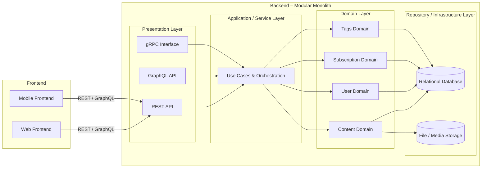
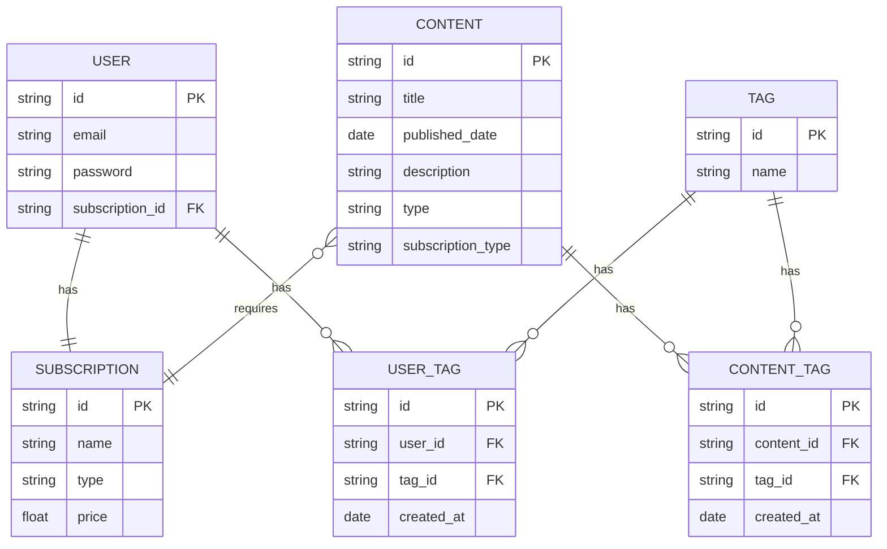

## Table of Contents

- [Table of Contents](#table-of-contents)
- [1. Overview](#1-overview)
  - [1.1 Purpose](#11-purpose)
  - [1.2 Scope](#12-scope)
  - [1.3 Audience](#13-audience)
- [2. Requirements](#2-requirements)
  - [2.1 Functional Requirements](#21-functional-requirements)
  - [2.2 Non-Functional Requirements](#22-non-functional-requirements)
- [3. High-Level Architecture](#3-high-level-architecture)
  - [3.1 Architecture Style](#31-architecture-style)
  - [3.2 High-Level Architecture Diagram](#32-high-level-architecture-diagram)
  - [3.3 Request Flow](#33-request-flow)
  - [3.4 Architectural Principles](#34-architectural-principles)
- [4. Detailed Design](#4-detailed-design)
  - [4.1 Domain \& Module Responsibilities](#41-domain--module-responsibilities)
  - [4.2 Layer Responsibilities \& Dependency Rules](#42-layer-responsibilities--dependency-rules)
  - [4.3 API Design (High-Level)](#43-api-design-high-level)
  - [4.4 Data Model (ERD)](#44-data-model-erd)
- [5. Technology Stack \& Key Decisions](#5-technology-stack--key-decisions)
  - [5.1 Frontend](#51-frontend)
  - [5.2 Backend](#52-backend)
  - [5.3 Content Management System (CMS)](#53-content-management-system-cms)
  - [5.4 Database](#54-database)
  - [5.5 Media Storage](#55-media-storage)
  - [5.6 Notifications](#56-notifications)
  - [5.7 Cloud Infrastructure](#57-cloud-infrastructure)
  - [5.8 Architecture Decision Summary](#58-architecture-decision-summary)
- [6. Scalability \& Performance](#6-scalability--performance)
  - [6.1 Traffic Characteristics](#61-traffic-characteristics)
  - [6.2 Application Scalability](#62-application-scalability)
  - [6.3 Caching Strategy](#63-caching-strategy)
  - [6.4 Database Performance](#64-database-performance)
  - [6.5 Media \& Content Delivery](#65-media--content-delivery)
  - [6.6 Subscription \& Access Control Performance](#66-subscription--access-control-performance)
  - [6.7 Future Scalability Considerations](#67-future-scalability-considerations)
  - [6.8 Scalability Strategy Summary](#68-scalability-strategy-summary)
- [7. Security Design](#7-security-design)
  - [7.1 Authentication](#71-authentication)
  - [7.2 Authorization](#72-authorization)
  - [7.3 Subscription Enforcement](#73-subscription-enforcement)
  - [7.4 Data Protection](#74-data-protection)
  - [7.5 Media Access Security](#75-media-access-security)
  - [7.6 Secrets Management](#76-secrets-management)
  - [7.7 Security Best Practices](#77-security-best-practices)

## 1. Overview

### 1.1 Purpose

The purpose of this document is to describe the software design for a subscription-based public health education platform targeting a broad audience in the Asia Pacific region. This document provides a shared understanding of the system’s goals, architecture, and key design decisions to guide engineering implementation and future evolution.

The platform is designed to deliver daily educational content—including articles, videos, and interactive tools—while supporting personalization, subscription-based access control, and high read traffic. The design emphasizes scalability, maintainability, and development efficiency for a small engineering team.

### 1.2 Scope

**In Scope**

* Content delivery of public health articles, videos, and interactive tools
* Content organization by topics and categories
* Personalization based on user preferences and behavior
* Subscription management and access control for premium content
* High-read, low-write traffic optimization
* API-first design to support future mobile applications
* Scalable architecture that can grow with product and team size

**Out of Scope**

* Native mobile application implementation (iOS / Android)
* Payment provider implementation details beyond integration boundaries
* Content creation and editorial workflow tools (CMS internals)

### 1.3 Audience

* Backend Engineers responsible for API and business logic
* Frontend Engineers consuming APIs (web and future mobile)
* DevOps / SRE managing infrastructure and deployments
* Product Managers and Stakeholders reviewing system capabilities and constraints

---

## 2. Requirements

### 2.1 Functional Requirements

**Content Management & Delivery**

* FR-1: The system shall deliver public health content in the form of articles, videos, and interactive tools.
* FR-2: The system shall support organizing content by tags.
* FR-3: The system shall allow content to be marked as free or premium.
* FR-4: The system shall support publishing daily content updates.

**User Management**

* FR-5: The system shall allow users to register and authenticate.
* FR-6: The system shall store user preferences such as selected topics and interests.
* FR-7: The system shall personalize content feeds based on user preferences.

**Subscription & Access Control**

* FR-8: The system shall support subscription-based access to premium content.
* FR-9: The system shall validate subscription status on each protected content request.

**API & Client Support**

* FR-10: The system shall expose REST APIs for web and future mobile clients.
* FR-11: The system shall be designed to support additional API interfaces (GraphQL, gRPC) without changing core domain logic.

### 2.2 Non-Functional Requirements

**Performance & Scalability**

* NFR-1: The system shall be optimized for high-read, low-write traffic patterns.
* NFR-2: The system shall horizontally scale by running multiple instances of the application.
* NFR-3: The system shall support regional traffic from the Asia Pacific region with consistent performance.

**Availability & Reliability**

* NFR-4: The system shall target an availability of at least 99.9%.
* NFR-5: The system shall degrade gracefully in case of partial failures (e.g., media service unavailable).

**Security**

* NFR-6: The system shall enforce authentication and authorization for protected resources.
* NFR-7: The system shall securely manage secrets and credentials.
* NFR-8: The system shall encrypt data in transit.

**Maintainability & Extensibility**

* NFR-9: The system shall enforce clear modular boundaries between domains.
* NFR-10: The system shall allow new domains or features to be added without major refactoring.
* NFR-11: The system shall support future mobile applications without architectural changes.
* NFR-12: The system will have a structure that is manageable by a small engineering team.

**Operational Concerns**

* NFR-13: The system shall provide structured logging and metrics for observability.
* NFR-14: The system shall be deployable through automated CI/CD pipelines.

---

## 3. High-Level Architecture

### 3.1 Architecture Style

The system uses a **Modular Monolith** architecture. It is deployed as a single application while maintaining strict internal module boundaries to separate concerns and encapsulate business domains.

This approach enables:

* Fast development for a small team
* Low operational complexity
* Clear domain ownership
* A future path to extract microservices if needed

### 3.2 High-Level Architecture Diagram



### 3.3 Request Flow

* Client (Web or Mobile) sends a request via REST or GraphQL
* Presentation layer handles transport concerns and validation
* Application layer executes the relevant use case
* Domain layer applies business rules
* Repository layer interacts with database or file storage
* Response is returned to the client

### 3.4 Architectural Principles

* Single deployable unit with strong internal modularity
* API-first design for web and future mobile clients
* High-read traffic optimization readiness
* Clear separation between layers
* Horizontal scalability via application replication

---

## 4. Detailed Design

### 4.1 Domain & Module Responsibilities

The backend is structured as a modular monolith with clear domain boundaries. Each domain owns its business logic, data models, and repository interfaces.

**Content Domain**

* Manages articles, videos, and interactive tools
* Handles content metadata (title, description, publish date)
* Determines whether content is free or premium
* Owns media references (but not storage implementation)

**User Domain**

* Manages user accounts and profiles
* Stores user preferences (topics, interests)
* Exposes user identity and preference information to other domains via service interfaces

**Subscription Domain**

* Manages subscription lifecycle (active, expired, canceled)
* Validates access rights to premium content
* Acts as the single source of truth for subscription status

**Tags Domain**

* Manages tags, topics, and categorization
* Supports content discovery and filtering
* Maintains relationships between content and tags

### 4.2 Layer Responsibilities & Dependency Rules

To maintain modularity and long-term maintainability, strict dependency rules are enforced:

* **Presentation Layer**

  * Handles HTTP / transport concerns only
  * Performs request validation and response mapping
  * Must not contain business logic
  * Performs request authorization

* **Application / Service Layer**

  * Implements use cases (e.g., "Get Personalized Feed")
  * Coordinates multiple domains when necessary
  * Performs permission checks

* **Domain Layer**

  * Contains pure business logic and domain rules
  * Must not depend on presentation or infrastructure layers
  * Communicates with other domains only via well-defined interfaces

* **Repository / Infrastructure Layer**

  * Implements data persistence and external integrations
  * Must not contain business rules
  * Depends on domain-defined repository interfaces

**Dependency Direction**

```
Presentation → Application → Domain → Repository
```

Reverse dependencies are not allowed.

### 4.3 API Design (High-Level)

The system follows an **API-first** approach.

* **REST API** (Primary)

  * Used by web and future mobile clients
  * Versioned endpoints (e.g., `/api/v1/...`)

* **GraphQL API** (Optional)

  * Used for flexible content queries and aggregation
  * Reads optimized for content-heavy views

* **gRPC Interface** (Internal / Future)

  * Intended for internal module communication or future service extraction

All APIs delegate business logic execution to the application layer.

### 4.4 Data Model (ERD)

The following Entity Relationship Diagram (ERD) describes the core data model and relationships between main entities. The model is designed to support subscription-based access control, content categorization, and personalization.



**Relationship Notes**

* A **User** has exactly one **Subscription**.
* A **User** can be associated with multiple **Tags**, and each **Tag** can belong to many users.
* A **Content** item requires one **Subscription** type to determine access control.

---

## 5. Technology Stack & Key Decisions

This section describes the selected technology stack and the rationale behind each choice. The goal is to balance development speed, scalability, maintainability, and long-term flexibility for a growing product and engineering team.

### 5.1 Frontend

**Web Frontend**

* **Technology**: React (Vite or Next.js)

**Reasons**:

* React provides a mature ecosystem and strong community support
* Vite enables fast local development and simple builds
* Next.js supports server-side rendering (SSR) and static site generation (SSG), which is beneficial for SEO and high-read content platforms
* Shared React knowledge reduces onboarding cost for engineers

**Mobile Frontend**

* **Technology**: React Native

**Reasons**:

* Enables code sharing and conceptual consistency with the web frontend
* Faster development compared to native iOS/Android
* Strong ecosystem and long-term industry adoption
* Well-suited for content-heavy and API-driven applications

### 5.2 Backend

* **Technology Options**: Go or Node.js (NestJS)

**Reasons**:

* Both options support high-concurrency, API-driven workloads

* **Node.js + NestJS**:

  * Opinionated structure encourages clean architecture and modular design
  * Strong TypeScript support improves maintainability and refactoring safety
  * Good fit for a modular monolith architecture

* **Go**:

  * Excellent performance and low memory footprint
  * Simple concurrency model (goroutines) for high-read traffic
  * Strong candidate for future service extraction if performance-critical components emerge

The final choice can be aligned with team expertise, with architecture principles remaining consistent.

### 5.3 Content Management System (CMS)

* **Technology**: Strapi

**Reasons**:

* Headless CMS model fits API-first architecture
* Allows non-engineering teams to manage content independently
* Supports custom content types and role-based access
* Can be integrated as an internal module or external service
* Reduces time-to-market for content publishing workflows

### 5.4 Database

* **Technology**: PostgreSQL

**Reasons**:

* Strong relational model fits user, subscription, and content relationships
* ACID compliance ensures data consistency
* Excellent support for indexing and read-heavy workloads
* Mature ecosystem and strong cloud support (AWS/GCP)

### 5.5 Media Storage

* **Technology**: AWS S3

**Reasons**:

* Designed for large-scale object storage
* Highly durable and cost-effective
* Integrates well with CDN solutions for global content delivery
* Offloads heavy media traffic from the core backend

### 5.6 Notifications

* **Technology**: Firebase Cloud Messaging (FCM)

**Reasons**:

* Reliable push notification delivery for mobile platforms
* Simple integration with React Native
* Scales well without additional infrastructure management

### 5.7 Cloud Infrastructure

* **Technology**: AWS or GCP

**Reasons**:

* Both providers offer managed services suitable for small teams
* Global regions support low-latency access in Asia Pacific
* Strong ecosystem for containerization, CI/CD, and observability
* Flexibility to start simple and evolve toward more advanced setups

### 5.8 Architecture Decision Summary

* Prioritize developer productivity and clarity over premature optimization
* Use proven, widely adopted technologies to reduce operational risk
* Design choices favor incremental scaling and future evolution

---

## 6. Scalability & Performance

This section describes how the system is designed to handle high read traffic, scale with user growth in the Asia Pacific region, and maintain acceptable performance as content and usage increase.

### 6.1 Traffic Characteristics

* Predominantly **read-heavy** workload (content browsing, feeds, content detail pages)
* Write operations are relatively low and predictable (content publishing, user updates)
* Traffic spikes are expected around:

  * Daily content publication times
  * Notifications or campaigns
  * Public health events

The architecture is optimized accordingly.

### 6.2 Application Scalability

**Horizontal Scaling (Primary Strategy)**

* The modular monolith backend is designed to be **stateless**
* Multiple application instances can be deployed behind a load balancer
* Scaling is achieved by increasing the number of replicas

**Why this works well for a Modular Monolith**:

* Avoids complexity of service-to-service communication
* Simple operational model for a small team
* Proven approach for high-read platforms

### 6.3 Caching Strategy

Caching is critical to support high-read traffic and reduce database load.

**Levels of Caching**:

* **CDN / Edge Caching**

  * Public content (articles, images, videos) cached at the edge
  * Reduces latency for Asia Pacific users

* **Application-Level Caching**

  * Frequently accessed data (content lists, metadata)
  * Short TTL to ensure freshness

* **HTTP Cache Headers**

  * Enables browser-level caching
  * Improves perceived performance for end users

### 6.4 Database Performance

* PostgreSQL optimized for read-heavy workloads
* Proper indexing on:

  * Published content
  * Tags and topic relationships
  * Subscription lookups

**Read Optimization Techniques**:

* Read replicas (if supported by cloud provider)
* Query optimization and pagination
* Avoidance of N+1 queries at application level

### 6.5 Media & Content Delivery

* Media assets (videos, images) are stored in object storage (Aws S3)
* Served via CDN instead of backend servers
* Backend only handles metadata and access control

**Benefits**:

* Significantly reduces backend bandwidth usage
* Improves load times for media-heavy content
* Enables near-global scalability

### 6.6 Subscription & Access Control Performance

* Subscription checks are lightweight and optimized
* Subscription status can be cached per user session
* Premium content access is validated at request time

This ensures security without becoming a performance bottleneck.

### 6.7 Future Scalability Considerations

* Extraction of high-load domains (e.g., Content delivery) into separate services if required
* Introduction of message queues for async workloads (notifications, analytics)
* Regional deployments if traffic distribution demands it

### 6.8 Scalability Strategy Summary

This section summarizes how the system scales across different stages of product growth, ensuring that early development remains simple while supporting long-term expansion.

**MVP Stage (0–10k Users)**

* Single modular monolith deployment
* Horizontal scaling with a small number of application replicas
* Single primary PostgreSQL database instance
* CDN enabled for static and media content
* Basic application-level caching
* Focus on simplicity, fast iteration, and low operational overhead

**Growth Stage (100k–>1M Users)**

* Increased number of backend replicas behind a load balancer
* Read replicas for PostgreSQL to offload read traffic
* More aggressive CDN caching for public content
* Expanded application-level caching strategy
* Asynchronous processing for notifications and non-critical workloads
* Optional extraction of high-traffic domains if scaling limits are reached

This phased approach allows the platform to grow without major architectural rewrites while maintaining stability and performance.

---

## 7. Security Design

This section outlines the security principles and mechanisms used to protect user data, enforce subscription access, and secure the platform against common threats. Security is designed to be robust while remaining practical for a small engineering team.

### 7.1 Authentication

* Users authenticate using email and password credentials
* Authentication is implemented using **token-based authentication** (e.g., JWT)
* Access tokens are:

  * Short-lived to reduce risk if compromised
  * Sent via HTTP headers for API requests

**Rationale**:

* Token-based authentication is stateless and scales well horizontally
* Suitable for both web and mobile clients
* Avoids server-side session management

### 7.2 Authorization

* Role and permission checks are performed per use case
* Subscription status is validated before granting access to premium content

**Access Control Rules**:

* Public content is accessible without authentication
* Premium content requires:

  * Authenticated user
  * Active subscription

This ensures business rules remain centralized and consistent.

### 7.3 Subscription Enforcement

* Subscription validation is performed on every request accessing premium content
* Subscription data is retrieved from the Subscription domain
* Subscription status may be cached briefly to reduce database load

**Why request-time validation**:

* Prevents unauthorized access due to stale state
* Simplifies enforcement across web and mobile clients

### 7.4 Data Protection

* Sensitive data (e.g., passwords) is stored using strong hashing algorithms
* All client-server communication is encrypted using HTTPS

### 7.5 Media Access Security

* Media assets are stored in object storage (Aws S3)
* Direct public access is restricted for premium content
* Time-limited, signed URLs are used for authorized media access

**Benefits**:

* Prevents unauthorized sharing of premium content
* Reduces backend load
* Scales securely for high traffic

### 7.6 Secrets Management

* Secrets (API keys, database credentials) are not stored in source code
* Secrets are managed using cloud-native secret management solutions
* Access to secrets is limited by least-privilege principles

### 7.7 Security Best Practices

* Input validation at API boundaries
* Protection against common web vulnerabilities (e.g., injection, XSS)
* Regular dependency updates and security patches
* Audit logging for sensitive operations
