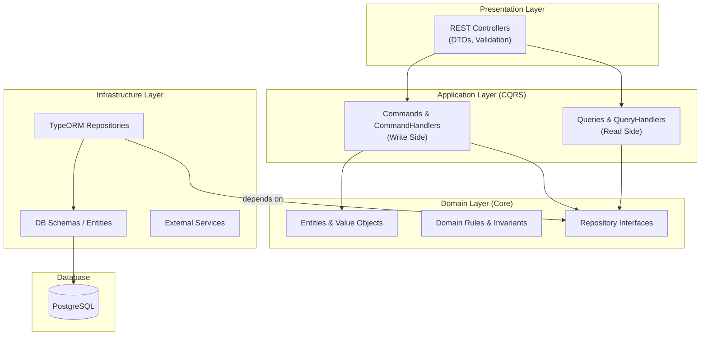
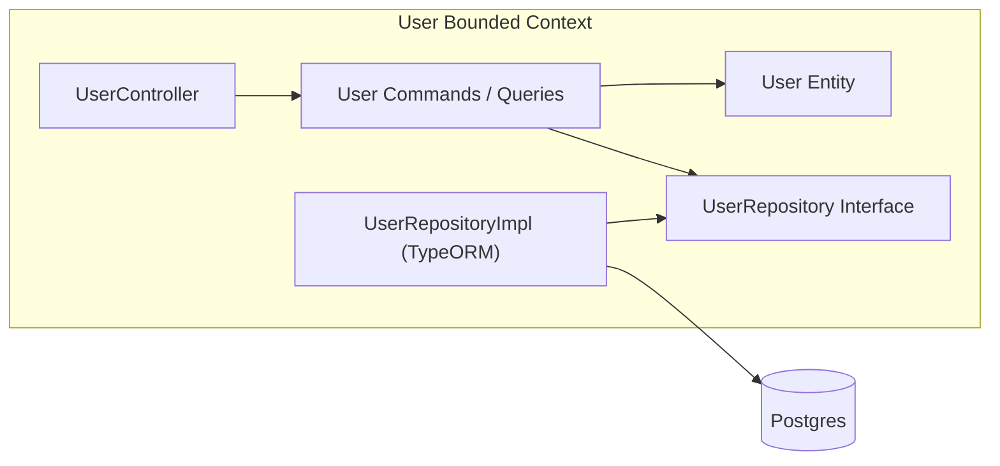
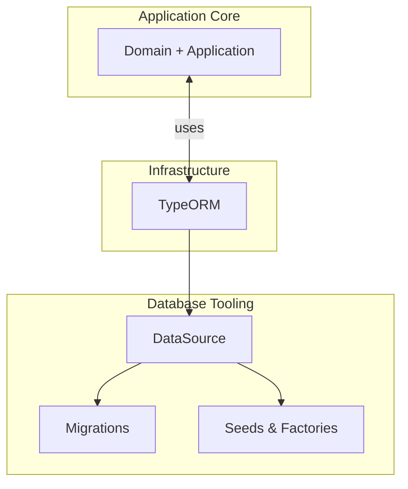

[1. Setup instructions](#1-setup-instructions)
[1.1 Project setup](#11-project-setup)
[1.2 Compile and run the project](#12-compile-and-run-the-project)
[1.3 Run tests](#13-run-tests)
[1.4 Run Migration](#14-run-migration)
[1.5 Run Seed](#15-run-seed)
[2. Architecture explanation](#2-architecture-explanation)
[3. Trade-offs](#3-trade-offs)
[4. Judgment and Decision-making](#4-judgment-and-decision-making)

## 1. Setup instructions

```
├── README.md
└── backend
    ├── README.md
    ├── database
    │   ├── data-source.ts
    │   ├── factories
    │   │   ├── content.factory.ts
    │   │   ├── subscription.factory.ts
    │   │   └── user.factory.ts
    │   ├── migrations
    │   │   └── 1767837447275-initial-migration.ts
    │   └── seeds
    │       ├── initial.seed.ts
    │       └── seed.ts
    ├── eslint.config.mjs
    ├── nest-cli.json
    ├── package.json
    ├── pnpm-lock.yaml
    ├── src
    │   ├── app.module.ts
    │   ├── config
    │   │   └── env.schema.ts
    │   ├── content
    │   │   ├── application
    │   │   │   └── content.query.ts
    │   │   ├── content.module.ts
    │   │   ├── domain
    │   │   │   ├── content.entity.ts
    │   │   │   └── content.repository.ts
    │   │   ├── infrastructure
    │   │   │   └── db
    │   │   │       └── content.repository.ts
    │   │   └── presentation
    │   │       └── rest
    │   │           └── rest.controller.ts
    │   ├── main.ts
    │   ├── shared
    │   │   ├── jwt.ts
    │   │   └── schema
    │   │       ├── content-tag.schema.ts
    │   │       ├── content.schema.ts
    │   │       ├── enums.ts
    │   │       ├── subscription.schema.ts
    │   │       ├── tag.schema.ts
    │   │       ├── user-tag.schema.ts
    │   │       └── user.schema.ts
    │   ├── subscription
    │   │   ├── application
    │   │   │   └── subscription.command.ts
    │   │   ├── domain
    │   │   │   ├── subscription.entity.ts
    │   │   │   └── subscription.repository.ts
    │   │   ├── infrastructure
    │   │   │   └── db
    │   │   │       └── subscription.repository.ts
    │   │   ├── presentation
    │   │   │   ├── rest.controller.ts
    │   │   │   └── subscription.dto.ts
    │   │   └── subscription.module.ts
    │   └── user
    │       ├── application
    │       │   ├── user.command.spec.ts
    │       │   └── user.command.ts
    │       ├── domain
    │       │   ├── user.entity.spec.ts
    │       │   ├── user.entity.ts
    │       │   └── user.repository.ts
    │       ├── infrastructure
    │       │   └── db
    │       │       └── user.repository.ts
    │       ├── presentation
    │       │   ├── rest.controller.ts
    │       │   └── user.dto.ts
    │       └── user.module.ts
    ├── test
    │   ├── app.e2e-spec.ts
    │   └── jest-e2e.json
    ├── tsconfig.build.json
    └── tsconfig.json
```

### 1.1 Project setup

Move to folder `backend` and create `.env` from `.env.example`

```bash
$ pnpm install
```

### 1.2 Compile and run the project

```bash
# development
$ pnpm start

# watch mode
$ pnpm start:dev

# production mode
$ pnpm start:prod
```

### 1.3 Run tests

```bash
# unit tests
$ pnpm test

# e2e tests
$ pnpm test:e2e

# test coverage
$ pnpm test:cov
```

### 1.4 Run Migration

When creating a migration file is necessary to include the path `located at ./database/migrations`.

```bash
# create migration
$ pnpm migration:generate ./database/migrations/[name-migrations]

# example
$ pnpm migration:generate ./database/migrations/some-migrations

# apply and migrate changes
$ pnpm migration:run

# revert or rollback migration
$ pnpm migration:revert
```

### 1.5 Run Seed

Seeding for dummy data purpose

```bash
# create seeding data
$ pnpm seed
```

---

## 2. Architecture explanation

This project is built using **Domain-Driven Design (DDD)** combined with **CQRS (Command Query Responsibility Segregation)** and **Clean Architecture principles**. The goal is to keep business logic independent from frameworks, databases, and delivery mechanisms. It's a implementing from [this doc](../README.md).







---

## 3. Trade-offs

  * Requires a deeper shared understanding of the business domain between developers and stakeholders
  * Introduces more boilerplate, but makes each domain or service easier to isolate
  * Requires a strong understanding of DDD and CQRS concepts
  * Increases complexity and slows initial development in exchange for long-term maintainability, scalability, and clear business boundaries

---

## 4. Judgment and Decision-making

1. What would you build first in the first 30 days?
  In the first 30 days, I would prioritize establishing strong business domain clarity and aligning closely with stakeholders before implementing features, ensuring that what we build solves the right problems.
2. What would you not build yet — and why?
  Optimization, during the early phase, the priority is establishing the foundation and core business features, while optimization will be incrementally improved as the product evolves.
3. What are the top 3 technical risks in this platform?
  The main technical risks are domain misalignment, overengineering complexity, and maintaining consistent architectural discipline across the team.
4. How would you onboard a junior developer into this codebase?
  While this codebase is not immediately junior-friendly, I would onboard juniors by first teaching DDD and CQRS principles. Thanks to clear documentation and consistent patterns, they will be able to align with the codebase over time.
5. How would you ensure quality while moving fast?
   I ensure quality while moving fast by building strong architectural boundaries, testing critical business logic, automating quality checks, and continuously aligning with stakeholders.
